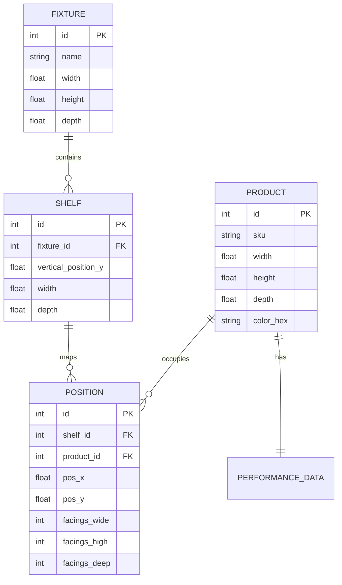

# Technical Specification: Retail Space Planning & Optimization Tool

## 1. System Architecture
The application is built as a decoupled full-stack monorepo.

### 1.1 Tech Stack
- **Backend**: Python FastAPI (High-performance asynchronous framework)
- **Database**: SQLite with SQLAlchemy ORM (Relational persistence)
- **Frontend**: React 18 + Vite (Atomic UI)
- **3D Rendering**: React Three Fiber (R3F) + Three.js
- **State Management**: Zustand (Lightweight reactive store)

## 2. Data Models (Schema)
The database utilizes a deeply relational structure to mirror enterprise Category Knowledge Bases (CKB).

## 3. Optimization Logic (`optimizer.py`)
The packing engine uses a greedy heuristic approach with spatial constraints.

1. **Sort Phase**: Products are ranked by `daily_unit_movement` DESC.
2. **Allocation Phase**: 
   - Each product starts with `facings_high` calculated as `floor(Shelf_Spacing / Product_Height)`.
   - `facings_deep` calculated as `floor(Shelf_Depth / Product_Depth)`.
   - `facings_wide` starts at 1 and increments until `DOS >= 7.0` OR `Current_X + (facings_wide * width) > Shelf_Width`.
3. **Placement**: If an item fits, its `pos_x` is recorded, and `current_x` increments. If not, the loop moves to the next `shelf.id`.

## 4. Frontend Implementation

### 4.1 R3F Scene Graph
- **Camera**: `OrthographicCamera` centered at `[0, 1000, 3000]`.
- **Navigation**: `OrbitControls` with `LEFT: ROTATE` and `RIGHT: PAN` for full 3D exploration.
- **Lighting**: `AmbientLight` (0.6) + `DirectionalLight` (with shadows).

### 4.2 Interactivity & Collision Detection
The drag-and-drop mechanism uses **Bounding Box Collision Detection**:
1. During `onDrag`, a `THREE.Box3` is computed for the active mesh.
2. It is checked against all sibling `Position` boxes on the same shelf using `box.intersectsBox(other)`.
3. If true, the `Matrix4` is instantly reverted to its state at the start of the frame, preventing spatial clipping.

## 5. API Reference

### `GET /api/planogram/{fixture_id}`
- **Purpose**: Returns the nested hierarchy of fixtures, shelves, and products.
- **Response**: `FixtureSchema` (includes `shelves` -> `positions` -> `product`).

### `POST /api/planogram/position/{position_id}/update`
- **Purpose**: Persists manual layout changes from the UI.
- **Request Body**: `pos_x`, `pos_y`, `facings_wide`.
- **Response**: Updated spatial coordinates and recalculated `capacity`/`dos`.
